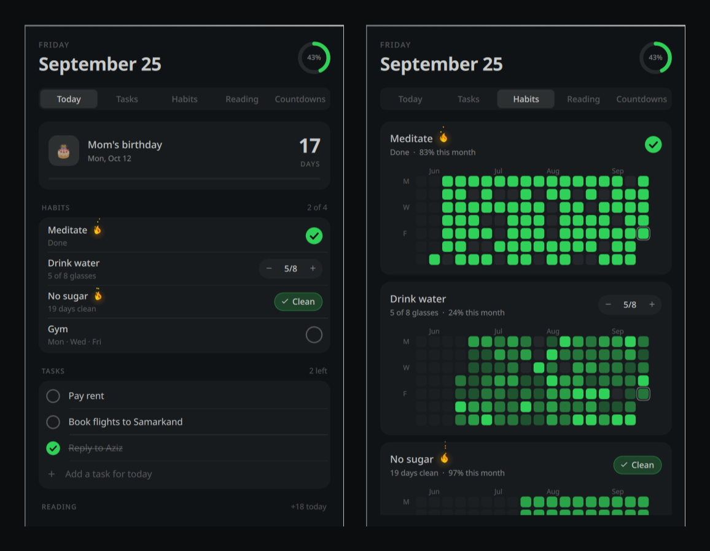

# LifeOS

Your day in one panel: tasks, habits with a GitHub-style history, reading
progress and countdowns, built into the Omarchy bar.



- **Today** — the next countdown, today's habits and tasks, the book you are reading.
- **Tasks** — type and press Enter; pick Today, Tomorrow, Weekend or Next week while you write.
- **Habits** — three kinds: *do it* (a check), *count it* (8 glasses of water), *avoid it* (no sugar).
  Eighteen weeks of history as green squares, and a flame once you keep one going three days in a row.
- **Reading** — add a book and its page count, log pages each day, and see when you will finish at your pace.
- **Countdowns** — something to look forward to, in big numbers. Gone once the day has passed.

The bar shows a ring for how much of today is done, next to the nearest countdown.

## Install

LifeOS needs [Bun](https://bun.sh), which runs its small local database:

```sh
omarchy pkg add bun
omarchy plugin add https://github.com/staruxian/omarchy-lifeos.git --enable
```

If Bun is missing, the panel says so and offers to install it.

**Optional:** get the `lifeos` terminal command (and a slightly faster panel):

```sh
~/.config/omarchy/plugins/staruxian.lifeos/install.sh
lifeos help
```

## Use

| In the bar | |
|---|---|
| Left click | open the panel |
| Right click | cycle the label: countdown · tasks left · habits · none |
| Middle click | open Tasks, ready to type |

| In the panel | |
|---|---|
| `1`–`5`, `h` / `l` | switch tabs |
| `n` | jump to the add field |
| `Esc` | close |

A keyboard shortcut, e.g. in `~/.config/hypr/bindings.lua`:

```lua
o.bind("SUPER + SHIFT + L", "LifeOS", "omarchy-shell staruxian.lifeos toggle")
```

From a terminal (with `install.sh`), everything updates the bar live:

```sh
lifeos                                   # today at a glance
lifeos add Pay rent due:fri
lifeos habit add Drink water --kind count --target 8 --unit glasses
lifeos read 25                           # pages for the book you are reading
lifeos event add Trip --on "nov 3" --emoji ✈️
```

Dates understand `today`, `tomorrow`, `fri`, `next mon`, `in 3 days`, `2w`, `3.11`, `nov 3`, `2026-11-03`.

## Your data

Everything stays on your machine, in `~/.local/share/lifeos/lifeos.db` (SQLite).
The panel reads a snapshot from `~/.local/state/lifeos/state.json`. LifeOS makes
no network requests and does not touch your configuration.

## Remove

```sh
omarchy plugin remove staruxian.lifeos
rm -f ~/.local/bin/lifeos                       # if you ran install.sh
rm -rf ~/.local/share/lifeos ~/.local/state/lifeos   # only if you want your data gone too
```

From a local checkout, `./uninstall.sh` does the same (`--purge` deletes data).

## Develop

```
manifest.json, *.qml, components/, pages/   the Omarchy shell plugin (QML)
cli/                                        the lifeos CLI (Bun + TypeScript + SQLite)
```

The CLI owns the data and computes every number the panel shows; the QML only
lays it out. `cd cli && bun test` runs the tests. `./install.sh` from a checkout
links it into the shell. The shell caches plugin QML, so run
`omarchy restart shell` after edits.

## License

MIT — see [LICENSE](LICENSE).
