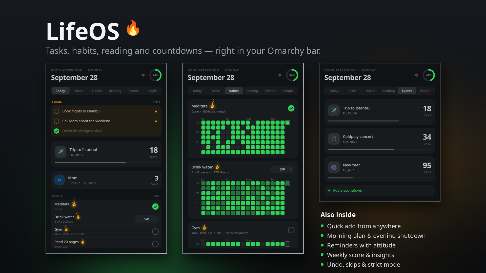

# LifeOS

Your day in one panel: tasks, habits with a GitHub-style history, reading
progress and countdowns, built into the Omarchy bar.



- **Today** — the next countdown, today's habits and tasks, the book you are reading.
- **Tasks** — type and press Enter; pick Today, Tomorrow, Weekend or Next week while you write.
- **Habits** — three kinds: *do it* (a check), *count it* (8 glasses of water), *avoid it* (no sugar).
  Eighteen weeks of history as green squares, and a flame once you keep one going three days in a row.
- **Reading** — add a book and its page count, log pages each day, and see when you will finish at your pace.
- **Events** — something to look forward to, in big numbers. Gone once the day has passed.
- **People** — the people who matter and their birthdays: the age they turn, the days
  left, and a reminder a week, a day, and on the day. Kept separate from Events; Today
  shows a birthday on its own card when it is within a week.

The bar shows a ring for how much of today is done, next to the nearest countdown.

### A day with a shape

- **Quick add from anywhere** — a Spotlight-style box: type `pay rent fri`, press Enter.
  A trailing `!` makes it one of today's priorities; `read 20` logs pages. It shows how it
  read your words before you commit.
- **Morning plan** — at login LifeOS asks for *at most three* priorities. They're pinned
  to the top of Today.
- **Evening shutdown** — every unfinished task gets a decision: done, tomorrow, next week,
  someday, or drop. Nothing rolls over silently.
- **Reminders that get louder** — a nudge when habits are still open, the ring turns
  orange two hours later, and pulses red an hour before bed.
- **Your week** — the share of promises kept (scheduled habits and priorities), perfect
  days, tasks, pages, your strongest habit and the one that needs attention.
- **Day complete** — close every habit and task and the ring celebrates.
- **Undo** — every change can be taken back from the banner (or `u`, or `lifeos undo`).
- **Edit anything** — double-click a task to rename, click its date to move it; habits,
  books and countdowns have an edit button.
- **Skips** — one per habit per week keeps a streak alive without pretending it was kept.
- **Habit reminders** — give a habit its own time ("Gym at 18:00") on top of the evening nudge.
- **A voice with attitude** — pick the notifications' tone: *Gentle* ("Time for Gym."),
  *Coach* ("Ten minutes in and you'll be glad you went.") or *Savage* ("Get your freaking
  ass up and go touch some grass. Gym won't do itself."). Lines fit the habit — workouts,
  reading, water, study, mindfulness — change daily, and Savage keeps asking every 45
  minutes until it's done.
- **Milestones** — 7, 14, 30, 50, 100, 200 and 365 days get confetti and a notification,
  and the flame grows bigger and hotter at a week, a month and a hundred days.
- **Evening check-in** — at shutdown, rate the day with a face and add one line.
- **Insights** — patterns from the last twelve weeks: your best and worst weekdays,
  how kept days feel, reading at weekends, best runs, and a month of check-ins.
- **Lock screen** — with [Lock Screen Explorer](https://github.com/SirJul1337/omarchy-lock-explorer),
  a *LifeOS* design shows the time, today's priorities, habits left and the next
  countdown (see [Extras](#extras)). It shows your priorities to anyone who sees the
  locked screen.

**Strict mode** (Settings) makes it firm: only today and yesterday can be logged, the
evening shutdown opens on its own, and a habit with a streak is deleted only by typing
its name.

## Install

```sh
omarchy plugin add https://github.com/staruxian/lifeos.git --enable
```

That's all: LifeOS runs on the Python 3 and SQLite that every Omarchy system already
has, so there is nothing else to install.

## Use

| In the bar | |
|---|---|
| Left click | open the panel |
| Right click | cycle the label: countdown · tasks left · habits · none |
| Middle click | open Tasks, ready to type |

| In the panel | |
|---|---|
| `1`–`6`, `h` / `l` | switch tabs |
| `n` | jump to the add field |
| `p` · `s` · `w` · `i` · `,` | plan · shutdown · week · insights · settings |
| `u` | undo |
| `Esc` | back / close |

Keyboard shortcuts, e.g. in `~/.config/hypr/bindings.lua`:

```lua
o.bind("SUPER + SHIFT + L", "LifeOS", "omarchy-shell staruxian.lifeos toggle")
o.bind("SUPER + ALT + A", "LifeOS quick add", "omarchy-shell staruxian.lifeos quickadd")
```

Settings live in the panel (gear icon) or `lifeos set`: `strict`, `plan`, `morning`,
`remind`, `shutdown`, `bedtime`, `notify`, `tone`.

From a terminal — add `alias lifeos='python3 ~/.config/omarchy/plugins/staruxian.lifeos/cli/lifeos/lifeos.py'`
to your shell config — everything updates the bar live:

```sh
lifeos                                   # today at a glance
lifeos add Pay rent due:fri
lifeos habit add Drink water --kind count --target 8 --unit glasses
lifeos read 25                           # pages for the book you are reading
lifeos event add Trip --on "nov 3" --emoji ✈️
lifeos quick "ship the release!"         # as the quick box: a priority for today
lifeos plan · lifeos shutdown · lifeos review · lifeos undo
lifeos set strict on
lifeos person add Aziz --born 12.10.2001
lifeos habit edit 2 --at 18:00           # a reminder of its own
lifeos checkin 4 good focus day
lifeos insights
```

Dates understand `today`, `tomorrow`, `fri`, `next mon`, `in 3 days`, `2w`, `3.11`, `nov 3`, `2026-11-03`.

## Your data

Everything stays on your machine, in `~/.local/share/lifeos/lifeos.db` (SQLite).
The panel reads a snapshot from `~/.local/state/lifeos/state.json`. LifeOS makes
no network requests and does not touch your configuration.

## Extras

The lock screen design is one file; copy it into Lock Screen Explorer's designs, then
pick *LifeOS* with `omarchy-shell lock explore` → Custom:

```sh
mkdir -p ~/.config/omarchy/lock-designs
cp ~/.config/omarchy/plugins/staruxian.lifeos/extras/LifeOS.lock.qml ~/.config/omarchy/lock-designs/LifeOS.qml
```

## Remove

```sh
omarchy plugin remove staruxian.lifeos
rm -rf ~/.local/share/lifeos ~/.local/state/lifeos ~/.cache/lifeos   # only if you want your data gone too
```

Upgrading from 1.3 or earlier, where `install.sh` could add a compiled `~/.local/bin/lifeos`?
It is no longer used; remove it with `rm ~/.local/bin/lifeos` (and use the alias above).

## Develop

```
manifest.json, *.qml, components/, pages/, views/   the Omarchy shell plugin (QML)
cli/lifeos/                                         the lifeos CLI (Python 3 standard library + SQLite)
cli/tests/                                          its tests
```

The CLI owns the data and computes every number the panel shows; the QML only
lays it out. `python3 -m unittest discover -s cli/tests` runs the tests. To work on a
checkout, link it into the shell with
`ln -s "$PWD" ~/.config/omarchy/plugins/staruxian.lifeos`. The shell caches plugin QML,
so run `omarchy restart shell` after edits. Architecture, rules and known QML pitfalls
are in [docs/DEVELOPING.md](docs/DEVELOPING.md).

## License

MIT — see [LICENSE](LICENSE).
